# ML Methods for Biophysics — Homework Solutions
**Student:** Yovan Hegel-Valentych  
**Course:** Machine Learning Methods, BIPH 2026  
**Instructor:** Oleh Mezhenskyi  
**Tools:** R 4.6 · tidyverse · broom · yardstick · pROC · rpart · randomForest

---

## Repository contents

| File | Topic |
|---|---|
| [`class1_tidy_data_homework.qmd`](class1_tidy_data_homework.qmd) | Tidy data pipeline — messy penguin dataset |
| [`class2_linear_regression_challenge.qmd`](class2_linear_regression_challenge.qmd) | Linear regression model comparison |
| [`class3_logistic_regression_homework.qmd`](class3_logistic_regression_homework.qmd) | Logistic regression on Wisconsin Breast Cancer |
| [`class4_pca_homework.qmd`](class4_pca_homework.qmd) | PCA dimensionality reduction |
| [`class5_trees_challenge.qmd`](class5_trees_challenge.qmd) | Decision Trees and Random Forests |
| [`REPORT.md`](REPORT.md) | Detailed written report with all results |

All `.qmd` files are self-contained Quarto documents — run `quarto render <file>.qmd` to produce the HTML output with all plots.

---

## Class 1 — Tidy Data and Tidyverse Workflow

**Dataset:** Synthetic messy Palmer Penguins (333 observations, 11 columns)  
**Goal:** Full tidyverse pipeline: inspect → clean → filter → mutate → pivot → join → summarise

### Pipeline summary

| Step | Operation | Result |
|---|---|---|
| 1 | Inspect | Mixed case in `species`/`island`/`sex`; NAs in 4 columns |
| 2 | Clean | `str_to_title()` + `drop_na()` → 272 rows |
| 3 | Filter | High/medium quality · Biscoe + Dream · body mass > 3 000 g → **205 rows** |
| 4 | Mutate | `body_mass_kg`, `bill_ratio`, `large_penguin` flag |
| 5 | Pivot | `pivot_longer()` → 820 rows (205 × 4 measurements) |
| 6 | Join | `left_join()` with island metadata |
| 7 | Summarise | Grouped by species × island × sex × protected area |

### Key results

**Gentoo males on Biscoe** are the heaviest group (mean ≈ 5 480 g).
The `bill_ratio` (length/depth) differs clearly across species — Gentoo bills are
proportionally longer and narrower, reflecting their fish-heavy diet vs.
krill-specialised Adelie and Chinstrap penguins.

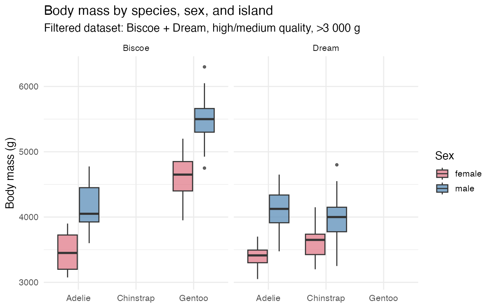

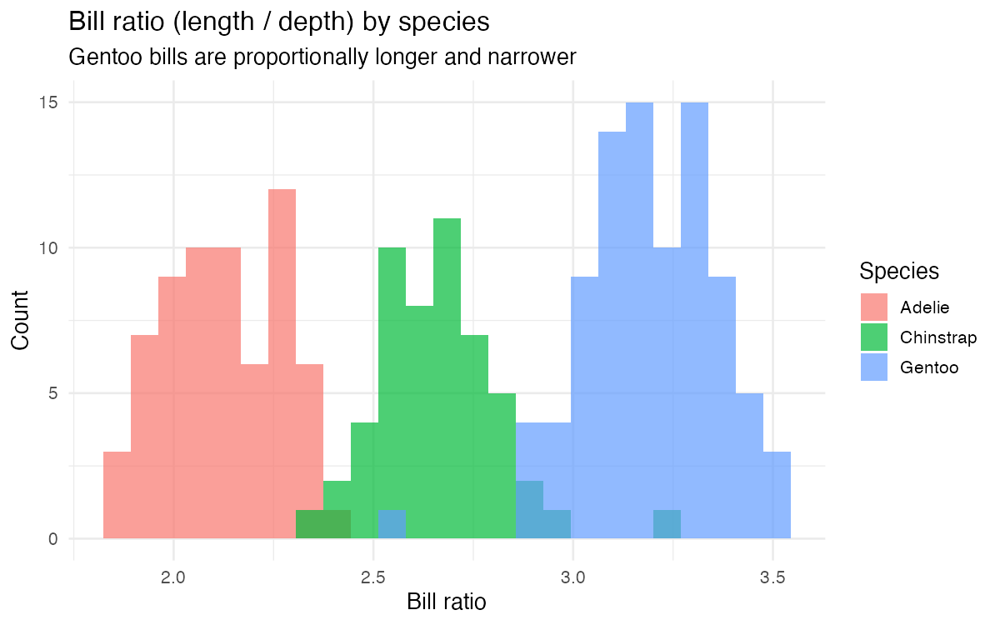

---

## Class 2 — Linear Regression Mini Challenge

**Dataset:** `mpg` (ggplot2, 234 cars) · **Target:** `hwy` · **Constraint:** `cty` excluded (r ≈ 0.96)  
**Split:** 75% train / 25% test

### Models built

| Model | Description | adj. R² | Test RMSE |
|---|---|---|---|
| M1 | `hwy ~ displ` | 0.663 | 4.73 |
| M2 | `hwy ~ poly(displ,2) + class` | 0.832 | 3.01 |
| M3 | M2 + `drv + cyl + fl` | 0.896 | 2.19 |
| **M4** | **Backward AIC selection** | **0.914** | **2.15** |

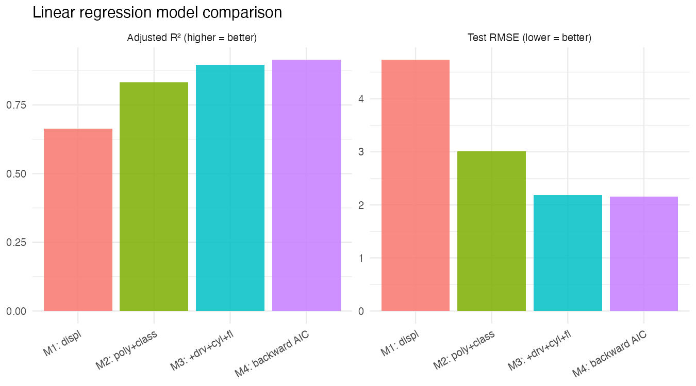

Adding vehicle `class` and drivetrain (`drv`) explains most of the variance
not captured by displacement alone. Backward AIC selection (M4) automatically
converges on a set of predictors closely matching domain intuition.

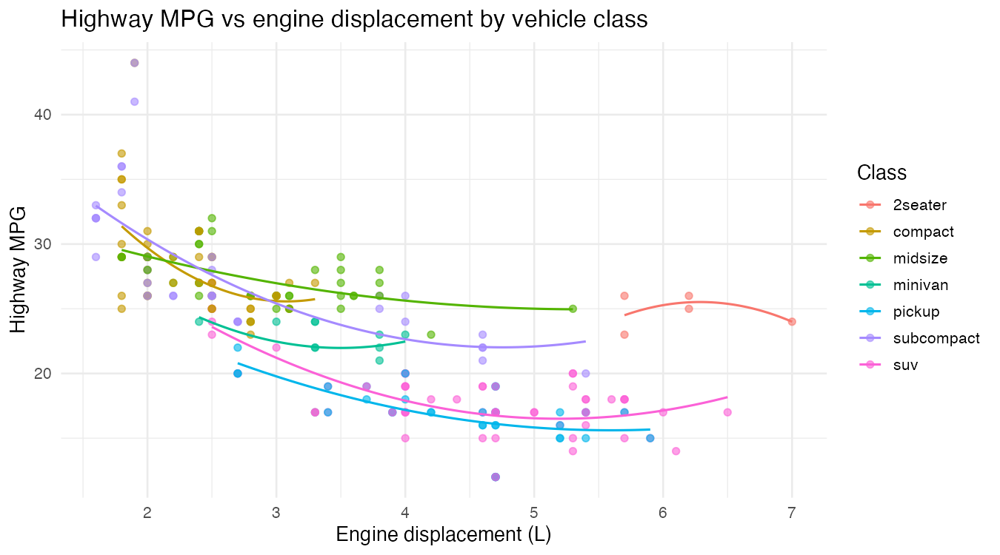

### Assumption check — best model (M4)

The residual plot shows approximately constant spread with a mild trend at the
extremes — typical for fuel-efficiency data where physical constraints create
natural upper and lower bounds.

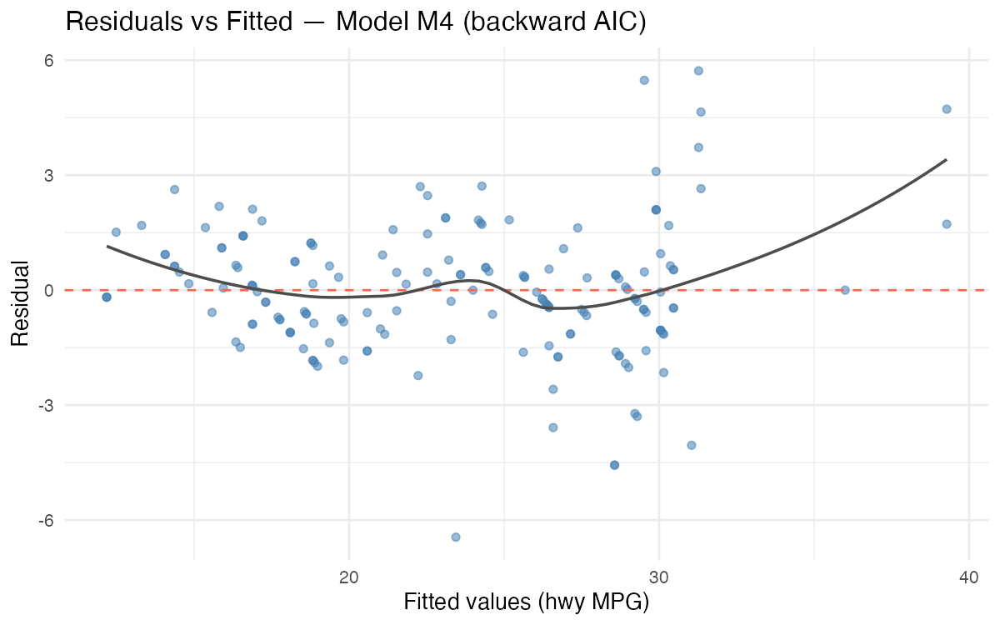

---

## Class 3 — Logistic Regression on Wisconsin Breast Cancer

**Dataset:** BreastCancer (mlbench), 683 rows after NA removal  
**Target:** malignant (positive class) / benign · **Split:** stratified 75/25

### Technical note on GLM prediction

With `factor(levels = c("malignant","benign"))`, R encodes malignant = 0 and benign = 1.
`predict(type="response")` returns **P(benign)**, so the correct classification rule is:

```
P(benign) ≥ threshold  →  predict "benign"
P(benign) <  threshold  →  predict "malignant"
```

### Predictor correlations

Several features are highly collinear (e.g., `Cell.size` and `Cell.shape`, r ≈ 0.90).
This motivates AIC-based selection over using all predictors blindly.

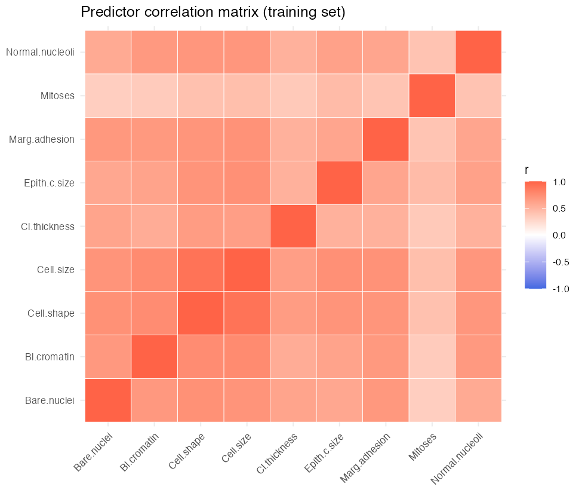

### Model comparison

| Model | Accuracy | Recall | AUC |
|---|---|---|---|
| M1 — 5 selected predictors | 0.913 | 0.917 | 0.984 |
| M2 — all 9 predictors | 0.932 | 0.967 | 0.988 |
| **M3 — backward AIC** | **0.942** | **0.967** | **0.987** |

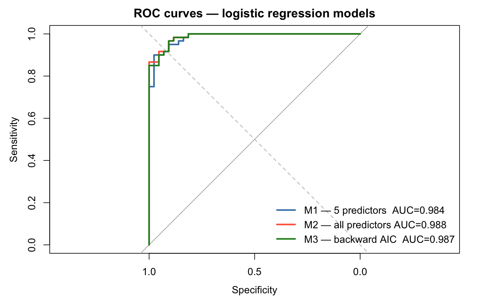

M3 achieves AUC comparable to M2 with fewer predictors — preferred for
clinical deployment due to better interpretability and lower overfitting risk.

### Threshold analysis

In a screening context, higher thresholds push more samples toward the
"malignant" prediction, increasing recall at the cost of specificity.
The default threshold of 0.5 maximises F1 for this dataset.

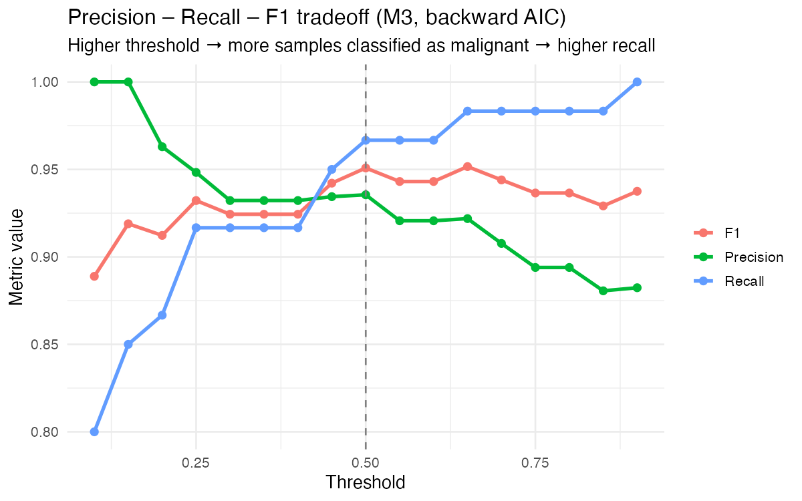

---

## Class 4 — PCA Dimensionality Reduction

**Dataset:** Wisconsin Diagnostic Breast Cancer (WDBC), 569 samples, 30 features  
**Question:** How many principal components are sufficient for classification?

### Variance decomposition

Only **7 principal components** are needed to explain 90% of total variance —
a direct consequence of the high collinearity among the geometric nuclear features
(`radius`, `perimeter`, `area` are almost perfectly correlated by construction).

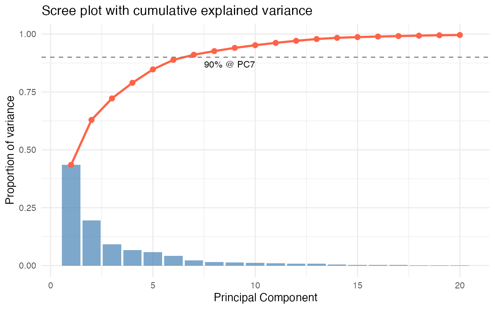

### Class separation in PC space

PC1 and PC2 together already provide near-perfect visual separation of malignant
and benign cases, confirming that the two classes differ primarily along the
directions of maximum variance.

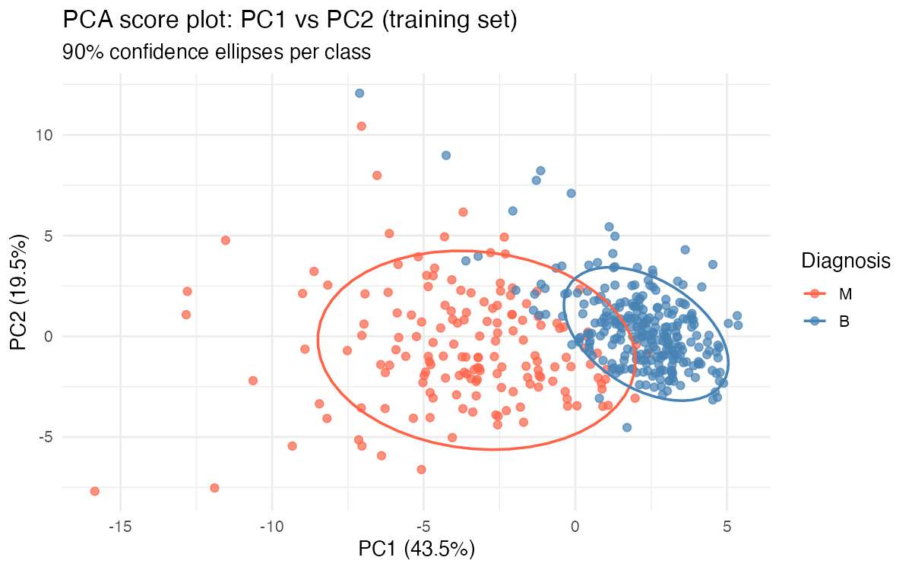

### Classification performance vs dimensionality

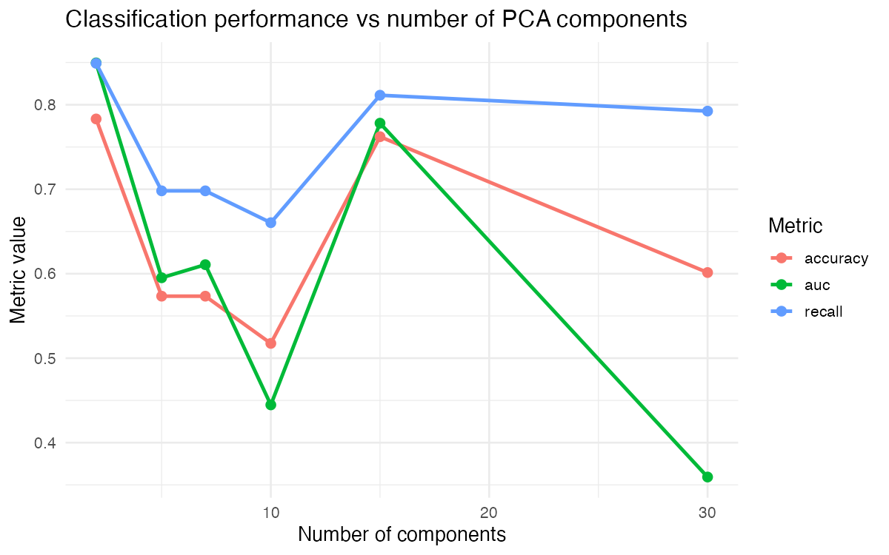

**Key finding:** 5–10 PCs achieve near-maximum AUC, reducing the feature space
from 30 to ~7 dimensions without meaningful loss in predictive performance.
Beyond ~10 PCs, GLM convergence becomes unstable due to perfect class separation
in high-dimensional PC space — a known limitation of standard logistic regression.

---

## Class 5 — Decision Trees and Random Forests

**Dataset:** WDBC (same 75/25 split as Class 4)

### Task 1 — Complexity parameter sweep

The `cp` parameter in `rpart` controls the minimum improvement required to
attempt a split. Smaller cp → deeper tree → higher recall but more variance.

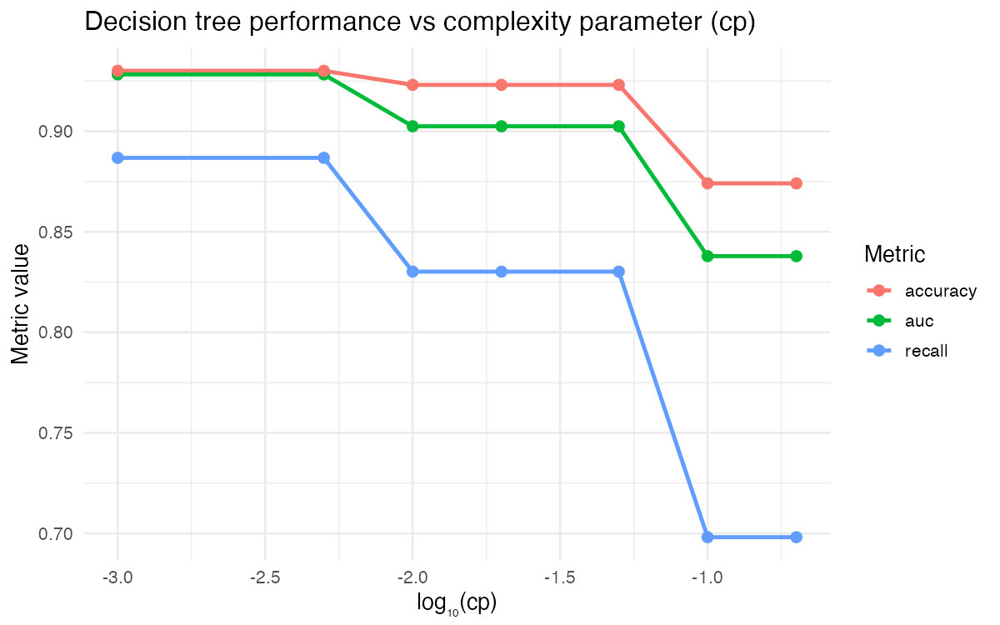

The tree stabilises at **4 leaves** for cp ≤ 0.005, achieving AUC ≈ 0.928.
Further reducing cp does not add leaves — the problem is structurally solved
by a very shallow tree on this dataset.

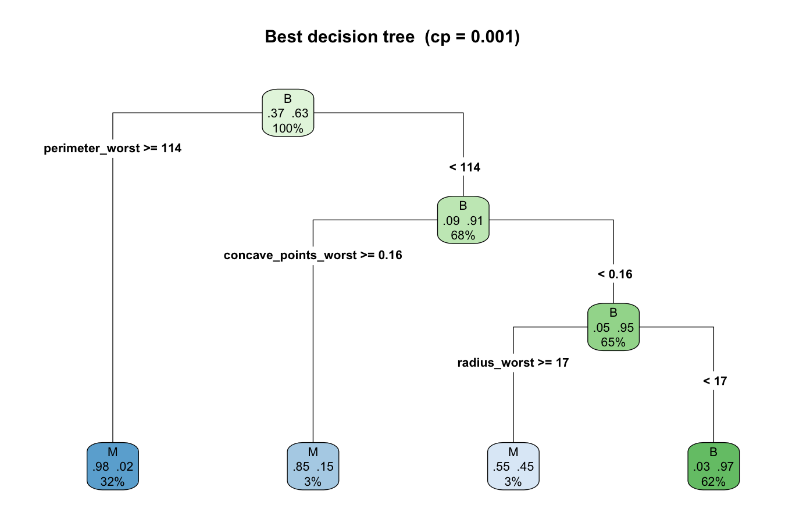

### Task 2 — Random Forest: ntree = 100 vs 500

| Model | AUC | Accuracy | Recall | F1 |
|---|---|---|---|---|
| RF ntree = 100 | 0.985 | 0.944 | 0.906 | 0.923 |
| **RF ntree = 500** | **0.988** | **0.951** | **0.925** | **0.933** |

The OOB error converges well before 100 trees. The performance difference between
100 and 500 trees is marginal (~0.003 AUC) on this dataset, but 500 is the safer
default for larger, noisier problems.

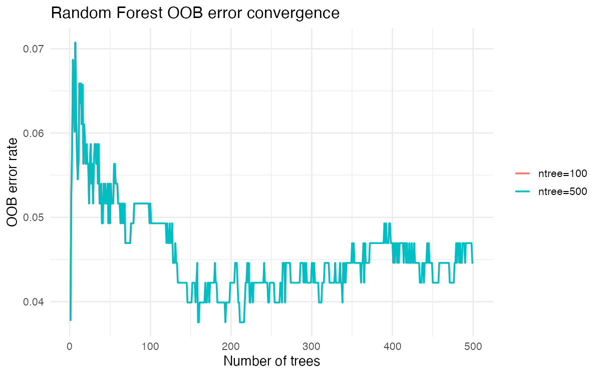

### Task 3 — Feature importance

Features ranked in the top-10 by **both** models:
`perimeter_worst`, `area_worst`, `radius_worst`, `concave_points_worst`, `concavity_worst`

This cross-model agreement strengthens the biological interpretation: the "worst"
(per-tumour maximum) shape descriptors are robustly the most discriminative
regardless of the importance measure used (Gini improvement vs. permutation accuracy).

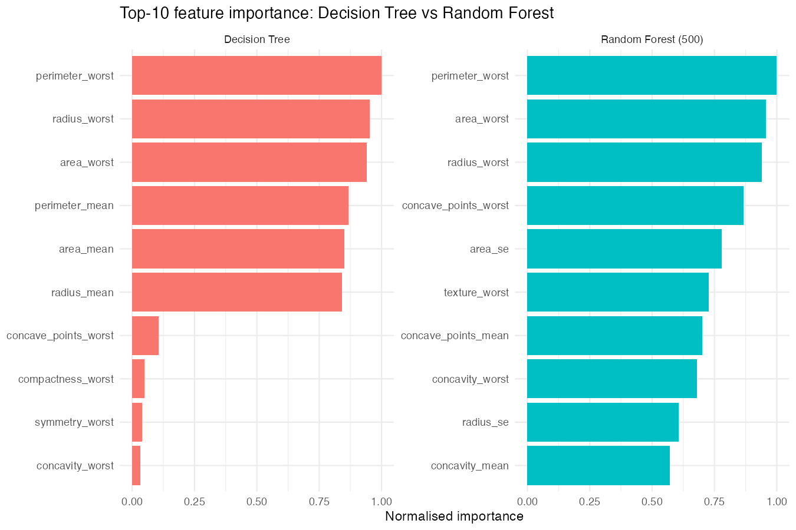

### Task 4 — ROC comparison across all models

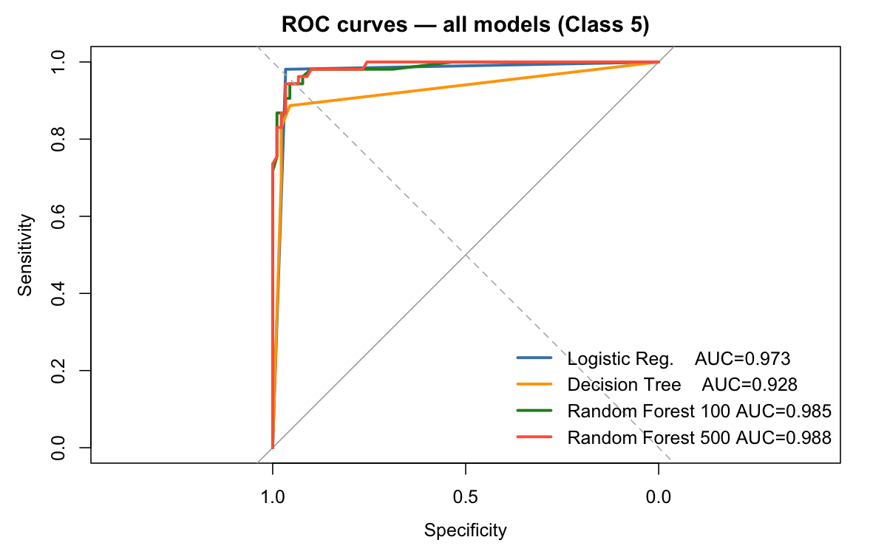

| Purpose | Recommended model | Rationale |
|---|---|---|
| **Explanation** | Decision Tree (cp ≈ 0.001) | 4 leaves = 3 auditable rules |
| **Prediction** | Random Forest (ntree = 500) | Highest AUC, stable OOB estimate |
| **Regulatory** | Logistic Regression | Interpretable coefficients, standard in biomedical literature |

---

## Reproducibility

```
R version   4.6.0 (2026-04-24)
tidyverse   2.0.0
broom       ≥ 1.0
yardstick   ≥ 1.0
pROC        ≥ 1.18
mlbench     ≥ 2.1
rpart       ≥ 4.1
randomForest 4.7-1.2
```

All analyses use `set.seed(2026)`. The course `materials/` folder is listed in
`.gitignore` and is not included in this repository.
